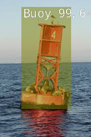
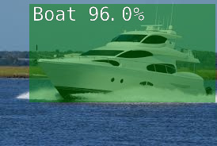
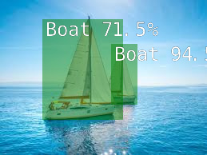
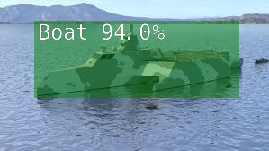
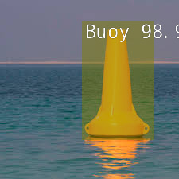

# Pytorch-SSD for Marine Objects 4.4
The objective of this project is to identify marine objects (Boat, Buoy) using the newest pytorch-ssd from @dustu-nv that exploits the capabilities of JP4.4. This marine ssd repository was originally inspired by Dusty Franklin’s (@dusty-nv) pytorch-ssd GitHub repository found at the following link:

https://github.com/dusty-nv/pytorch-ssd

Mr. Franklin has now includes this pytorch-ssd in his latest jetson-inference repository found at the following link:

https://github.com/dusty-nv/jetson-inference/blob/master/docs/pytorch-ssd.md

This is a Single Shot MultiBox Detector using MobilNet. We basically followed his newest example as was documented except that we used our marine dataset and not fruit. This method has matured and is now easy to use and deploy as a very good object detection technique, especially taking advantage of the Jetson GPU capabilities. 

Before starting we completely updated our jetson-inference with Dusty's latest code from his repository and installed all of the requirements. 

# Download additional images with labels:
We took advantage of accessing additional images with labels in the open_image format that can now be obtained using Dusty's open_image_downloader.py program:

	python3 open_images_downloader.py --class-names "Boat"

However, we chose to download only 2500 images using the following command: 

	python3 open_images_downloader.py --max-images=2500 --class-names "Boat"

We are running our ssd programs out of the /jetson-inference/python/training/detection/ssd/ directory, but with the recommended install this ssd technique can be run from any directory. 

The download was very simple creating the /data/train/
					  /data/test/
					  /data/validation/

subdirectory with images and the annotations: 

    sub-train-annotations-bbox.csv
    sub-test-annotations-bbox.csv
    sub-validation-annotations-bbox.csv
    class-description-bbox.csv

which are comma delimited .csv files as shown above with labels and boxes for these labels. 

We also downloaded the following .csv files with every annotations for each image too:

    train-annotations-bbox.csv
    test-annotations-bbox.csv
    validation-annotations-bbox.csv

We have not used the above full annotation .csv files at this point and are only working from the sub... files. 

# Supplement Downloaded data with our Existing Marine Images and Labels:
The downloaded data only had Boat classification, and we also needed Buoy labeled images too. We added our marine dataset from JP4.3 in this GitHub Philliec459 suite of repositories. We added these existing marine data to the newly downloaded images and .csv annotation files.

# Training
To train our marine dataset we used the following command:

	python3 train_ssd.py --model-dir=models/marine --batch-size=4 --num-epochs=60

Training first populates our /models/marine/ subdirectory with a label.txt file to define our classifications and mb1-ssd-Epoch-x-Loss-xxxxxxx.pth files for each Epoch in the models/marine subdirectory. 

We also found the --resume command to be useful in running additional Epochs from where you last left off. 

	python3 train_ssd.py --model-dir=models/marine --batch-size=4 --num-epochs=60 --resume=/home/craig/src/jetson-inference/python/training/detection/ssd2/models/marine/mb1-ssd-Epoch-9-Loss-3.176339123307205.pth

Once the training is complete, we then ran the following command to create the ssd-mobilnet.onnx file by using the following command:

	python3 onnx_export.py --model-dir=models/marine

The onnx file was made from the existing .pth file taken from the lowest Epoch Loss. The onnx file is then used to make the final marine object detection estimates. 

To evaluate our results we created an image subdirectory and loaded a series of Boat and Buoy images to observe how well the program performed. 

First, 

	mkdir test_marine

then we ran detectnet on the .jpg images from the image subdirectory:

	detectnet --model=models/marine/ssd-mobilenet.onnx --labels=models/marine/labels.txt \
          --input-blob=input_0 --output-cvg=scores --output-bbox=boxes \
            "images/*.jpg" test_marine

# Revise new Downloaded data to create High Quality Marine Dataset for training:
Detectnet did a fair job of boxing in the Boats and Buoys from the initial download data supplemented with our marine data. However, we were not completely satisfied. We reviewed each of the newly downloaded data images in the train, test and validation subdirectories and removed images that were not representative from our training perspective or object details. Obviously, an image of a fleet boats taken from a plane is not the perspective that we are looking for for our at-sea object detection project from our boat. We also eliminated images of the boat taken from the interior of the boat or images with people and a boat somewhere in the background. We culled the images to create this high quality dataset of training/testing images that produced a new set of a Loss of 1.85 using just 60 Epochs.

We did removed the images from the test/train/validation subdirectories, but we did not remove those images from our .csv files. During the ssd training, the program did point out that the images were missing and the data from these images were not used in the processing, but it did not appear to hamper our training. 

# Example Results:

The following command will eventually be used to create our video real-time object detection while at sea with alarms. 

	detectnet --model=models/fruit/ssd-mobilenet.onnx --labels=models/fruit/labels.txt \
          	--input-blob=input_0 --output-cvg=scores --output-bbox=boxes \
            	/dev/video1

# Command lines used in this pytorch-ssd processing using JP4.4:
	cd jetson-inference/python/training/detection/ssd
	wget https://nvidia.box.com/shared/static/djf5w54rjvpqocsiztzaandq1m3avr7c.pth -O models/mobilenet-v1-ssd-mp-0_675.pth
	pip3 install -v -r requirements.txt

	#python3 open_images_downloader.py --class-names "Boat"  - too many boats with labels too, good but huge

	python3 open_images_downloader.py --max-images=2500 --class-names "Boat"

	#added all of our marine Boat and Bouy data to train, test and validation sets including .csv file additions too.

### Train:
	Defaults Of Training: Balance_Data=False, Base_Net=None, Base_Net_Lr=0.001, Batch_Size=4, Checkpoint_Folder='Models/Marine', Dataset_Type='Open_Images', 	Datasets=['Data'], Debug_Steps=10, Extra_Layers_Lr=None, Freeze_Base_Net=False, Freeze_Net=False, Gamma=0.1, Lr=0.01, Mb2_Width_Mult=1.0, 		Milestones='80,100', Momentum=0.9, Net='Mb1-Ssd', Num_Epochs=10, Num_Workers=2, Pretrained_Ssd='Models/Mobilenet-V1-Ssd-Mp-0_675.Pth', Resume=None, 	Scheduler='Cosine', T_Max=100, Use_Cuda=True, Validation_Epochs=1, Weight_Decay=0.0005

	python3 train_ssd.py --model-dir=models/marine --batch-size=4 --num-epochs=60

	python3 train_ssd.py --model-dir=models/marine --batch-size=4 --num-epochs=60 --resume=/home/craig/src/jetson-	inference/python/training/detection/ssd/models/marine/mb1-ssd-Epoch-99-Loss-1.8643740839079808.pth

### Create ONNX file:
	python3 onnx_export.py --model-dir=models/marine

### Review Object Detection:
	detectnet --model=models/marine/ssd-mobilenet.onnx --labels=models/marine/labels.txt \
          	--input-blob=input_0 --output-cvg=scores --output-bbox=boxes \
		    "images/boat*.jpg" test_marine

	detectnet --model=models/marine/ssd-mobilenet.onnx --labels=models/marine/labels.txt \
          	--input-blob=input_0 --output-cvg=scores --output-bbox=boxes \
            	/dev/video1

	detectnet --model=models/marine/ssd-mobilenet.onnx --labels=models/marine/labels.txt \
          --input-blob=input_0 --output-cvg=scores --output-bbox=boxes \
            ./buoy_boats.mp4

	detectnet --model=models/marine/ssd-mobilenet.onnx --labels=models/marine/labels.txt \
          --input-blob=input_0 --output-cvg=scores --output-bbox=boxes \
            ./sail.mp4

	detectnet /dev/video1

